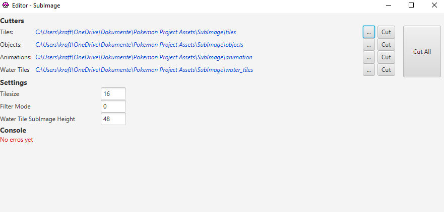
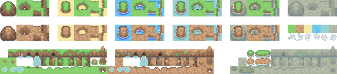
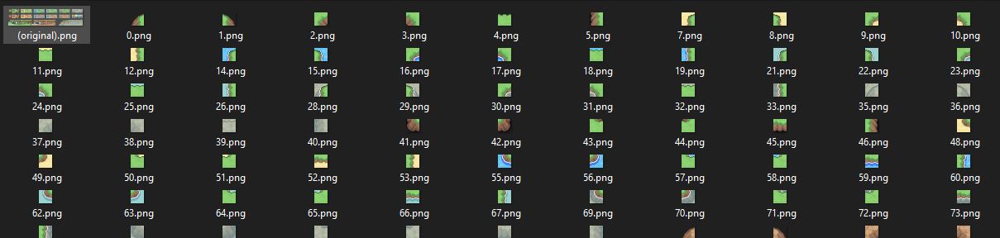

# SubImage

**SubImage** is a codebase designed to cut 2D PNGs which contain sprites for a 2D Pokémon game. You can either cut tiles (e.g., a 16x16 pixel raster) or cut by object, which segments individual components in the image and animation, ideal for creating animated sprites.

  

For example cut the original such as this one

  

into many tiles and put them numbered (according to their position on the grid) in a folder, that could look
like this:

  

Apart from tile cutting it also supports composite cutting (objects) and animated cutting for splitting the input
into frames (animations & water tiles).

TODO: full documentation for each command

## Table of Contents
- [Installation](#installation)
- [Maintainers](#maintainers)

## Installation

### Prerequisites

For running the developement code in IntelliJ you need 2 SDK version for java. One you use for the code the other you 
only for gradle (the reason is because gradle updates less frequently). For javaFX just get one decently new package.

- **Java SDK v.21**: [Download Java 21](https://www.oracle.com/java/technologies/downloads/#java21)
- **Java SDK v.15 for Gradle**: [Download Java 15](https://www.oracle.com/java/technologies/javase/jdk15-archive-downloads.html)
- **JavaFX v.22**: [Download JavaFX](https://gluonhq.com/products/javafx/)

### VM Options

To run the main application, you need to set additional VM options to specify the location of the JavaFX library. Here
is my example:

    --module-path "C:\<your-path>\javafx-sdk-22.0.1\lib" --add-modules=javafx.controls,javafx.fxml --add-exports javafx.base/com.sun.javafx.event=ALL-UNNAMED

Adjust the <your-path> accordingly to where your JavaFX library is located.

## Build

We use shadowjar here. See here: https://imperceptiblethoughts.com/shadow/getting-started/. Also read the build.gradle 
for more details.

## Maintainers
- [Ricardo Kraft](https://github.com/KraftRicardo)
